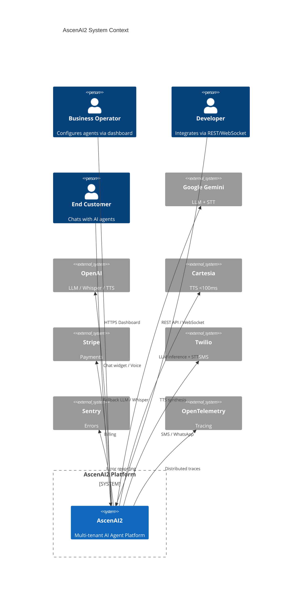
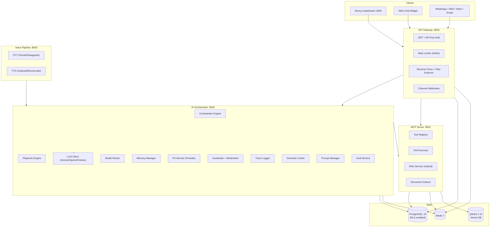
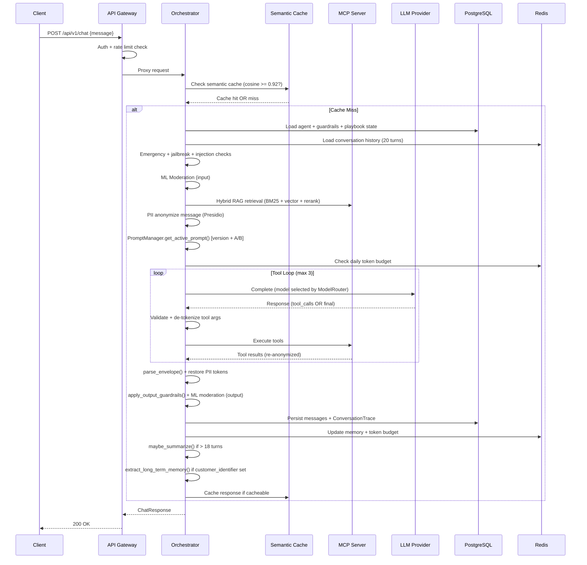
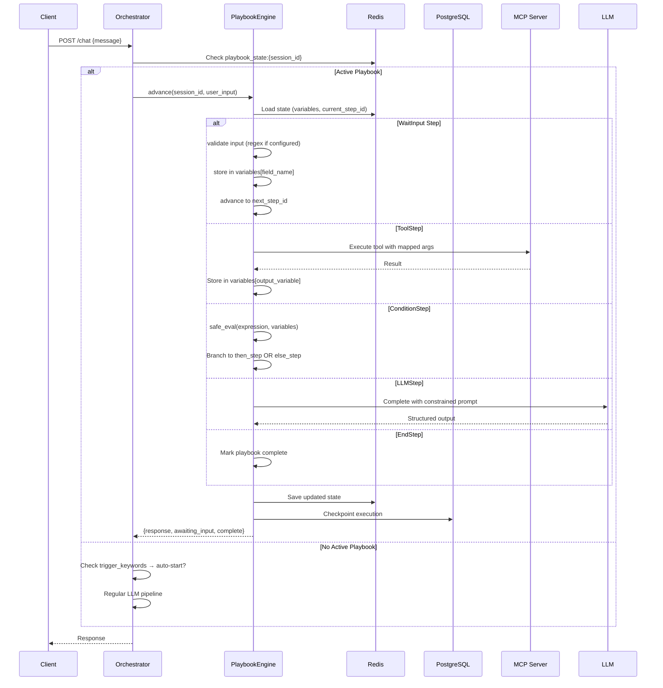
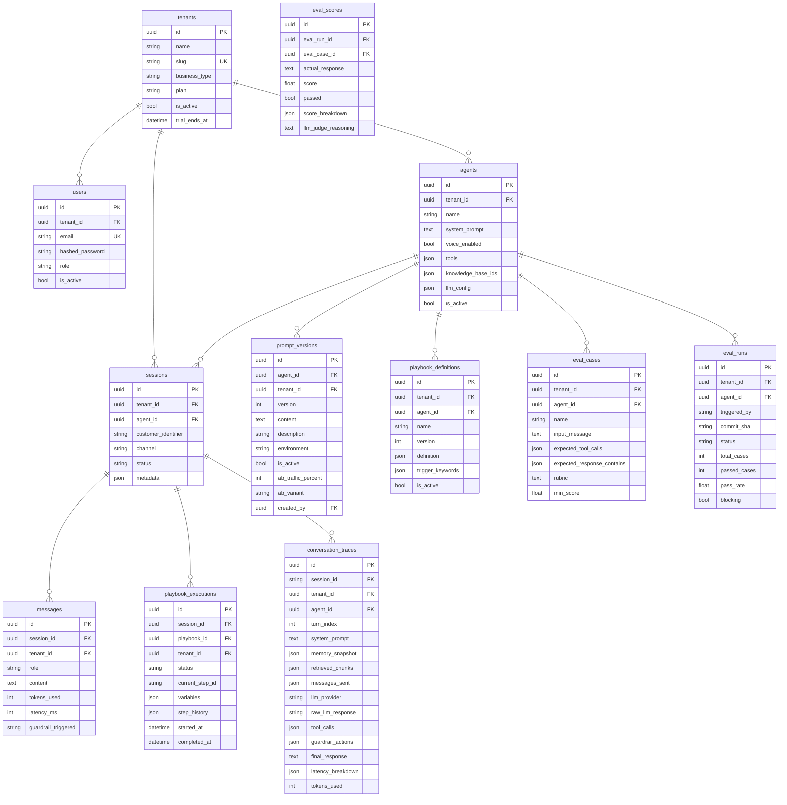
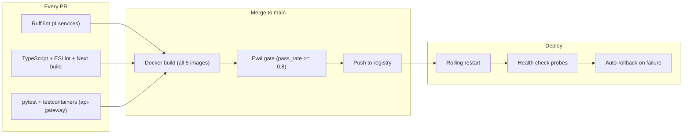

# AscenAI2 — Production Architecture Documentation

> Version: 2.0 | Branch: `claude/ai-agent-mcp-platform-dpseU`

---

## 1. Application Overview

### 1.1 Purpose

AscenAI2 is a **production-grade, multi-tenant AI Agent Platform** enabling businesses to deploy intelligent conversational agents across text and voice channels. It provides agent creation, knowledge base management, tool integration, guardrails, PII protection, compliance controls, billing, and analytics — all within a strict multi-tenant security boundary.

### 1.2 Target Users

| User Type | Core Needs |
|---|---|
| Business Operators | Agent builder, analytics dashboard, billing management |
| Developers | REST API, WebSocket, API keys, embed widget, webhooks |
| End Customers | Low-latency chat and voice responses |
| Platform Admins | Compliance controls, tenant management |

### 1.3 Functional Requirements

| ID | Requirement |
|---|---|
| FR-01 | Multi-turn text chat with streaming and session memory |
| FR-02 | Voice channel (STT → LLM → TTS) with sub-200ms target |
| FR-03 | Tool calling via MCP server (HTTP tools + built-in integrations) |
| FR-04 | RAG with hybrid search, reranking, and source citations |
| FR-05 | Guardrails: blocked keywords, profanity, PII, jailbreak, emergency, toxicity |
| FR-06 | PII pseudonymization (reversible, per-session, Presidio-backed) |
| FR-07 | Declarative playbook flows (state machine execution) |
| FR-08 | Per-tenant token budget and plan-based limits |
| FR-09 | GDPR erasure, prompt versioning, A/B testing |
| FR-10 | Full conversation trace logging and replay |

### 1.4 Non-Functional Requirements

| ID | Requirement | Target |
|---|---|---|
| NFR-01 | Chat API P99 first-token latency | < 1.5 s |
| NFR-02 | Voice end-to-end latency | < 200 ms |
| NFR-03 | Availability | 99.9% monthly |
| NFR-04 | Horizontal scaling | Linear to 10× base |
| NFR-05 | GDPR erasure SLA | 30 days |
| NFR-06 | Zero cross-tenant data leakage | Enforced at DB + app layers |

---

## 2. System Architecture

### 2.1 System Context



### 2.2 Component Architecture



### 2.3 Chat Request Flow (Non-Streaming)



### 2.4 Playbook Execution Flow



---

## 3. Data Architecture

### 3.1 Core Database Schema



### 3.2 Redis Key Reference

| Key Pattern | Type | TTL | Purpose |
|---|---|---|---|
| `rate_limit:{tenant_id}:{minute}` | String | 60s | Token-bucket rate limiting |
| `session:mem:{session_id}` | List (JSON) | 24h | Short-term conversation history |
| `session:summary:{session_id}` | String | 24h | LLM-compressed conversation summary |
| `summary_lock:{session_id}` | String | 30s | SETNX lock prevents duplicate summarization |
| `session:fallbacks:{session_id}` | String | 1h | Consecutive fallback counter |
| `pii_ctx:{session_id}` | String (JSON) | 1h | PII token ↔ value map |
| `token_budget:{tenant_id}:{date}` | String | 25h | Daily LLM token counter |
| `active_prompt:{agent_id}:{env}` | String (JSON) | 5min | Cached active prompt version |
| `tool_schemas:{agent_id}` | String (JSON) | 5min | Cached MCP tool schemas |
| `semantic_cache:{tenant_id}:{agent_id}:embeddings` | Hash | 1h | Cached query embeddings |
| `playbook_state:{session_id}` | String (JSON) | 24h | Active playbook execution state |
| `customer:ltm:{tenant_id}:{customer_id}` | String (JSON) | 30d | Long-term customer memory |
| `idempotency:{key}` | String | 5min | Chat idempotency dedup |
| `document_index_queue:{tenant_id}` | List | — | Background indexing job queue |
| `doc_status:{doc_id}` | String | 24h | Document indexing status |

---

## 4. Technology Stack

| Layer | Technology | Justification |
|---|---|---|
| **Frontend** | Next.js 14 (App Router) | SSR, TypeScript-first, Vercel ecosystem |
| **State** | Zustand + React Query | Minimal boilerplate; server state caching |
| **Styling** | TailwindCSS + Radix UI | Accessible headless components; no CSS bloat |
| **API Framework** | FastAPI | Native async; OpenAPI auto-gen; Pydantic |
| **ORM** | SQLAlchemy 2.0 async | asyncpg driver; type-safe; Alembic migrations |
| **Auth** | python-jose + passlib | HS256 JWT; bcrypt passwords |
| **LLM** | google-genai + openai SDK | Native async; multi-provider circuit breaker |
| **PII** | Presidio + spaCy | 50+ entity types; reversible pseudonymization |
| **Logging** | structlog (JSON) | Structured output; processor pipeline |
| **Metrics** | prometheus-fastapi-instrumentator | Zero-config RED metrics |
| **Primary DB** | PostgreSQL 16 | ACID; RLS; JSONB; battle-tested |
| **Cache** | Redis 7 | Sub-ms latency; atomic ops; TTL |
| **Vector DB** | Qdrant 1.11 | Purpose-built; payload filter; Rust core |
| **Containers** | Docker + Compose | Universal reproducibility |
| **CI/CD** | GitHub Actions | OIDC; matrix builds; no extra infra |
| **Tracing** | OpenTelemetry (vendor-neutral) | Supports Jaeger/Honeycomb/Tempo |

---

## 5. Security Architecture

### RBAC Matrix

| Permission | owner | admin | viewer |
|---|---|---|---|
| Create/delete agents | ✅ | ✅ | ❌ |
| Billing + team management | ✅ | ❌ | ❌ |
| API key management | ✅ | ✅ | ❌ |
| View analytics | ✅ | ✅ | ✅ |
| GDPR erasure | ✅ | ❌ | ❌ |

### Encryption Reference

| Data | Method |
|---|---|
| Passwords | bcrypt (12 rounds) |
| API keys (stored) | SHA-256 one-way |
| Tool credentials | AES-256 Fernet |
| JWT signing | HMAC-SHA256 (min 32-char key) |
| PII in LLM context | Reversible `{{PII_TYPE_N}}` tokens |
| Data in transit | TLS 1.2+ (Nginx termination) |

### OWASP Top 10 Mitigations

| Risk | Mitigation |
|---|---|
| Broken Access Control | `tenant_id` on every query + PostgreSQL RLS |
| Injection (SQL) | SQLAlchemy parameterized queries |
| Prompt Injection | `_ROLE_INJECTION_PATTERN` + `_JAILBREAK_PATTERN` + agents.py validation |
| Cryptographic Failures | Fernet encryption; bcrypt; SHA-256 for API keys |
| Security Misconfiguration | SECRET_KEY min-length validation at startup; CSP dev-only `unsafe-eval` |
| Credential Exposure | `_CREDENTIAL_SCRUB_PATTERN` in error messages; never log content |

---

## 6. DevOps & Deployment

### CI/CD Pipeline



### Health Probes

| Endpoint | Type | Checks | K8s Use |
|---|---|---|---|
| `/health/startup` | Heavy | DB + Redis + MCP | startupProbe |
| `/health/ready` | Fast | DB + Redis | readinessProbe |
| `/health/live` | Minimal | Process alive | livenessProbe |
| `/health` | Summary | Status + versions | Uptime monitoring |

---

## 7. Testing Strategy

### Testing Pyramid

| Layer | Coverage | Tools |
|---|---|---|
| Unit | Guardrails, PII, playbook conditions, memory | pytest |
| Integration | DB CRUD, Redis ops, MCP→Qdrant | testcontainers |
| API | All endpoints with real services | httpx.AsyncClient |
| E2E | Full user journeys | Playwright |
| Performance | 100 concurrent users | Locust |
| Security | OWASP scan + dependency audit | OWASP ZAP + pip-audit |

### Critical Path Regression Checklist

- [ ] Register → login → JWT claims correct
- [ ] Text chat (sync + stream) returns valid response
- [ ] Session memory persists across 5 consecutive turns
- [ ] Summarization fires at turn 18, history trimmed to 4 turns
- [ ] Playbook starts on trigger keyword, advances through steps, completes
- [ ] RAG sources included in response with score > 0.7
- [ ] Blocked keyword → guardrail_triggered set, 0 tokens used
- [ ] Emergency bypass → instant hardcoded response, no LLM
- [ ] PII tokens never appear in final response or DB message content
- [ ] Prompt version A/B: ~50% sessions hit treatment over 100 requests
- [ ] ConversationTrace created with full system_prompt for every turn
- [ ] Eval gate blocks deploy if pass_rate < 0.8
- [ ] Cross-tenant isolation: Tenant A cannot read Tenant B's agents
- [ ] PostgreSQL RLS: direct DB query with wrong tenant_id returns 0 rows
- [ ] Semantic cache returns identical response for cosine similarity >= 0.92

---

## 8. Observability

### Structured Log Format

```json
{
  "timestamp": "2026-03-28T10:15:32.450Z",
  "level": "info",
  "event": "chat_response_generated",
  "session_id": "sess_xyz",
  "tenant_id": "tenant_abc",
  "latency_ms": 842,
  "tokens_used": 347,
  "tool_calls": 1,
  "prompt_version_id": "v12",
  "cache_hit": false,
  "pii_entity_types": ["PERSON", "PHONE_NUMBER"],
  "guardrail_actions": [],
  "trace_id": "4bf92f3577b34da6"
}
```

### Key Prometheus Metrics

| Metric | Alert Threshold |
|---|---|
| `http_request_duration_seconds` P99 | > 4s |
| `ascenai_pii_envelope_parse_failures_total` | > 5% of requests |
| `llm_circuit_breaker_state` | open (any) |
| `ascenai_eval_pass_rate` | < 0.8 |
| `ascenai_semantic_cache_hit_rate` | < 10% (indicates cache not working) |
| `ascenai_playbook_step_failures_total` | > 1% per step |
| `token_budget_exceeded_total` | Any > 0 (alert tenant) |
